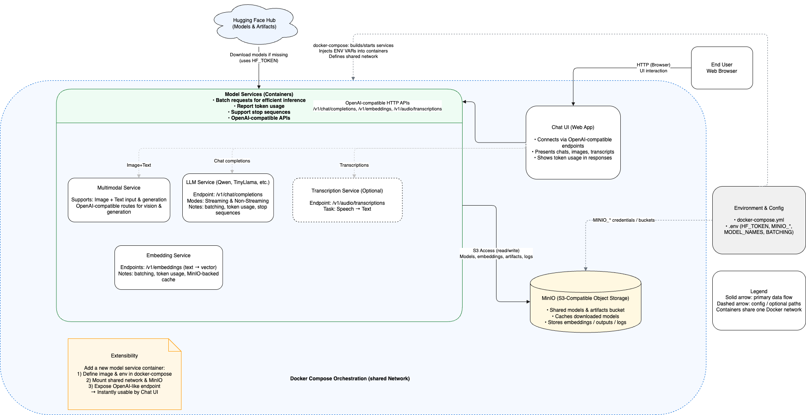

# Model Service Platform

A **containerized, multi-model AI inference platform** for serving Hugging Face models with OpenAI-compatible APIs, unified storage, and a modern web UI. Easily deploy LLMs, embedding models, multimodal models, and more—locally or in production.

---


---

## Features

- **Multi-Model Serving:** Run multiple LLMs, embedding, multimodal, and transcription models in parallel, each as a separate service.
- **OpenAI-Compatible API:** Each model exposes `/v1/chat/completions` and related endpoints, supporting both streaming and non-streaming requests.
- **Unified Object Storage:** Uses MinIO (S3-compatible) for model and artifact storage, enabling fast startup and easy model management.
- **Web Chat UI:** Modern chat interface connects to any deployed model via OpenAI-compatible endpoints.
- **Easy Extensibility:** Add new models or services by editing `docker-compose.yml`—no code changes required.
- **Efficient Inference:** Request batching, token usage reporting, and prompt formatting for production workloads.
- **Development Friendly:** Hot-reload, interactive API docs, and CLI tools for local development.

---

## OpenAI API Standard

This codebase follows the `v1` specification from OpenAI on API connectivity with chat models. As a result, off-the-shelf and open source tools designed
to interact with OpenAI models (such as HuggingFace's ChatUI) can easily integrate with this codebase. This also enables future data challenge
participants and remote data team developers to develop toolbox applications with their own OpenAI available models. For more information on OpenAI's
platform standards, view [their reference guide](https://platform.openai.com/docs/overview).

---

## Architecture Overview

```
[Chat UI] <--> [Model Services: LLM | Embedding | Multimodal | Transcription] <--> [MinIO Storage] <--> [Hugging Face Hub]
```

- **MinIO:** Central S3-compatible storage for all models and artifacts.
- **Model Services:** Each service runs a different Hugging Face model, exposes OpenAI-compatible APIs, and shares storage.
- **Chat UI:** Web app for interacting with any deployed model.
- **Docker Compose:** Orchestrates all services and networking.

---

## Quick Start

### 1. Clone the Repository

```sh
git clone https://gitlab.wildfireworkspace.com/eop/data-toolbox/model-service.git
cd model-service
```

### 2. Configure Environment

Copy `.env.example` to `.env` and fill in required values (MinIO credentials, Hugging Face token, etc.).

```sh
cp .env.example .env
# Edit .env with your credentials
```

### 3. Configure Chat UI (Optional)

If you want to use the Chat UI, create your configuration from the template:

```sh
cp chatui.env.template chatui.env
# Edit chatui.env to customize your models and branding
```

**Important:** The `chatui.env` file is gitignored to protect your configuration. Make sure to configure it before launching Chat UI.

### 4. Launch the Platform

**Option A: Core services only (models + storage)**
```sh
docker compose up -d
```

**Option B: With Chat UI**
```sh
docker compose -f docker-compose.yml -f docker-compose.chatui.yml up -d
```

- Model APIs are available at ports `8000`, `8001`, etc.
- Access the **Chat UI** at [http://localhost:3000](http://localhost:3000)

---

## Project Workflow

### Development Cycle

1. **Start Services:** Launch with `docker compose up -d`
2. **Check Logs:** Monitor startup with `docker compose logs -f [service-name]`
3. **Test APIs:** Use the interactive docs at `http://localhost:8000/docs`
4. **Make Changes:** Edit code, then rebuild: `docker compose up -d --build [service-name]`
5. **Stop Services:** `docker compose down` (add `-v` to remove volumes)

### Adding/Updating Models

1. **Edit Configuration:**
   - Add new service in `docker-compose.yml`
   - Update `chatui.env` to expose it in the UI

2. **Rebuild and Restart:**
   ```sh
   docker compose up -d --build
   ```

3. **Verify:**
   - Check API: `curl http://localhost:8000/v1/models`
   - Check Chat UI: Visit http://localhost:3000/settings

### Chat UI Configuration

The Chat UI uses version **0.8.4** (pinned) to ensure stable behavior with custom models. 

**Why version 0.8.4?**
- Newer versions (>= 0.9.0) auto-fetch 110+ community models from Hugging Face
- Version 0.8.4 respects your custom `MODELS` configuration
- Recommended for self-hosted deployments with custom endpoints

**To customize models:**
1. Edit `chatui.env`
2. Modify the `MODELS` array with your endpoints
3. Restart: `docker compose -f docker-compose.yml -f docker-compose.chatui.yml restart chatui`

Example multi-model configuration:
```env
MODELS=[{"name":"qwen","displayName":"Qwen 0.5B","endpoints":[{"type":"openai","baseURL":"http://llm:8000/v1"}]},{"name":"llava","displayName":"LLaVA Vision","multimodal":true,"endpoints":[{"type":"openai","baseURL":"http://multimodal:8003/v1"}]}]
```

---

## Adding a New Model

1. **Add Service to `docker-compose.yml`:**
   ```yaml
   my-new-model:
     build: ./model-service
     environment:
       MODEL_NAME: "huggingface/my-model"
       MODEL_TYPE: "llm"
     ports:
       - "8005:8000"
   ```

2. **Update Chat UI Configuration (optional):**
   Edit `chatui.env` and add your model to the `MODELS` array:
   ```env
   MODELS=[...,{"name":"my-model","displayName":"My Model","endpoints":[{"type":"openai","baseURL":"http://my-new-model:8000/v1"}]}]
   ```

3. **Restart Services:**
   ```sh
   docker compose up -d --build
   ```

No code changes are needed!

---

## Services

| Service         | Description                        | Default Port |
|-----------------|------------------------------------|--------------|
| minio           | S3-compatible object storage        | 9000/9001    |
| chatui          | Web chat interface                 | 3000         |
| llm             | LLM (e.g., Qwen)                   | 8000         |
| tinyllama       | LLM (e.g., TinyLlama)              | 8001         |
| embedding       | Embedding model                    | 8002         |
| multimodal      | Multimodal (image+text) model      | 8003         |
| transcription   | Speech-to-text model               | 8004         |

---

## Environment Variables

### Core Services (`.env` file)

See `.env.example` for all required variables:
- `MINIO_ROOT_USER`, `MINIO_ROOT_PASSWORD` - MinIO admin credentials
- `MINIO_SVC_USER`, `MINIO_SVC_PASSWORD` - Service account credentials
- `MINIO_ENDPOINT` - MinIO server endpoint
- `HF_TOKEN` - Hugging Face access token for downloading models

### Chat UI (`chatui.env` file)

**Important:** Copy `chatui.env.template` to `chatui.env` before first use.

Key variables:
- `MONGODB_URL` - MongoDB connection string
- `MODELS` - JSON array of model configurations
- `PUBLIC_APP_NAME` - Custom branding for the UI
- `ENABLE_COMMUNITY_MODELS` - Set to `false` to only show your custom models

---

## Troubleshooting

### Chat UI shows 110+ models instead of my custom ones

**Solution:** Ensure you're using Chat UI version **0.8.4** (check `docker-compose.chatui.yml`). Newer versions auto-fetch community models by default.

### Model service won't start

**Check:**
1. MinIO is running: `docker compose ps minio`
2. Environment variables are set in `.env`
3. Hugging Face token has correct permissions
4. Logs: `docker compose logs [service-name]`

### Chat UI can't connect to models

**Verify:**
1. Model services are running: `docker compose ps`
2. `chatui.env` has correct `baseURL` (use Docker service names like `http://llm:8000/v1`)
3. All services are on the same Docker network

---

## License

MIT License

---

## Acknowledgements

- [Hugging Face](https://huggingface.co/)